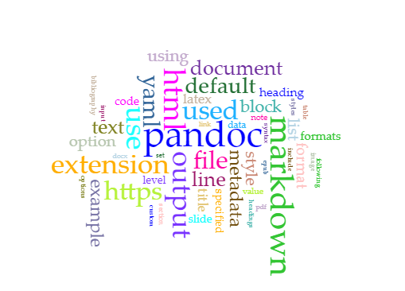

# Abstract

This is an abstract.

# Introduction

This is an introduction.!

# Methodology

This is a methodology.

## Data Collection

Describe the origin of the data. [^fn1]

## Processing Data

# Results

These are results.

# Analysis

This is an analysis.

# Discussion

This is a discussion

[Github](www.github.com)

# Works Cited

Various works cited here.

# Notes

[^fn1]: See https:wikipedia.org